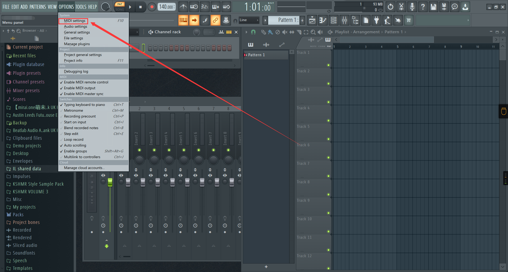
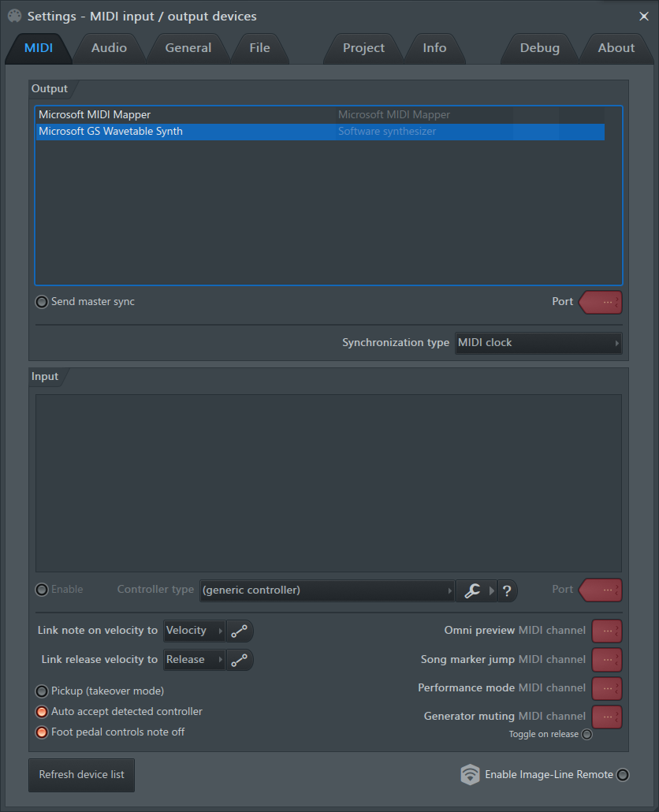

# 电子琴 midi 接口连接 FL Studio 的设置
## 还是先随便写点东西试试罢(
## 我在使用我的电子琴当做音源播放 MIDI 文件时，发现了 FL Studio 对 MIDI 很多有意思的设置，我在尝试搞明白它们的用途
::: tip
在此处打开，你也可以用 F10 快捷键来打开
:::

### 像这样，打开之后是这个界面
### Microsoft MIDI Mapper 还没搞清楚是什么东西
### 但是下方还有一个 Microsoft GS Wavetable Synth，这个是微软的 GS 波表合成器

### 你可以将它的 Port 调为 Port0 或者其他 Port，这样他就能用来播放 MIDI 通道的乐器了
::: tip
未完成
:::